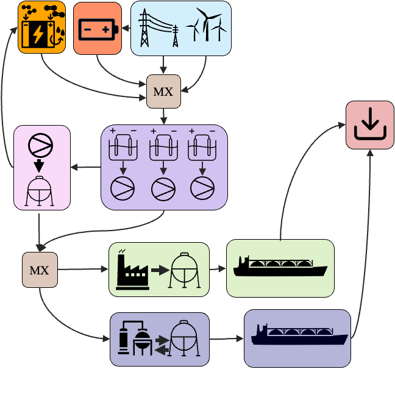

# Stochastic Operations Model [](https://opensource.org/licenses/MIT) [](https://www.imperial.ac.uk)
Open Source Model for a Hydrogen Supply Chain from Chile to Rotterdam, the modelled supply chain is shown in the figure, below:




## Dependencies [](https://www.python.org/downloads/release/python-3124/) [](https://anaconda.org/anaconda/conda/files?page=1&type=conda&version=24.5.0) [](https://www.gurobi.com/downloads/gurobi-optimizer-release-notes-v11-0-3/)
In order to run this model, a licence for [gurobi](https://www.gurobi.com/) is required, as is an installation of [conda](https://docs.anaconda.com/miniconda/). 

## Quick Start
For a quick start, run the folliwng command to clone the repository to your local machine:
```
git clone https://github.com/cja119/ChileRotterdamSupplyModel.git
```

Set up the conda environment:

```
conda env create -f dependencies.yml
```

Then activate the environment using the following:

```
source activate MIPSupplyChain
```
To run the sample formulation, execute the bash script as follows

```
bash SolveModel.sh
```
## Reproducing Publication Results
In order to reproduce the results of the scenario analyses, in a terminal run:
```
nano SolveModel.sh
```
Then modify the following by coding in **one** of the values in each brackets, to create the eight different scneario permutations. It is reccomended to modify the key parameter value to ensure saved runs don't override eachother:
```
reconversion=("True","False")
vector=("LH2","NH3")
grid_connection=("True","False")
```
Run the scripts, using the following command:
```
bash SolveModel.sh
```
## Parametric Modification
In order to manually change parameters, head to the pre-optimisation datastore and change the values of the parameters in the middle of the upper and lower bounds. These are taken as default values for the model when solving. Other, formulation specific, parameters can be found in the 'Executionscripts/BuildModel.py' file, this is accessed prior to each model solution. 

## Weather Data and TimeSeries Clustering
The clustered weatherdata csv can be found in the 'WeatherModel/WeatherData' folder, along with the appropriatley clustered demand signal and timeseries datasets. The unclustered dataset can also be found in this folder. Running the python scripts 'WeatherModel/MeteorologicalScripts/GetWeatherData.py' will grab the weatherdata files from the NASA Merra-2 database. This is achieved using the [EarthAccess Library](https://earthaccess.readthedocs.io/en/latest/) (N.B., this will require an [EarthData](https://urs.earthdata.nasa.gov/) account, with 'NASA GESDISC DATA ARCHIVE' activated under the applications tab). Once set up, save your username and password as environment variables using the following shell commands:
```
export EARTHDATA_USERNAME="Your_Username"
```

```
export EARTHDATA_PASSWORD="Your_Password"
```
The python file 'ClusterWeatherData.py' can then be used to generate the Culsters using Ward's method. N.B., this will override the default clustered datasets saved in the abovementioned csv files. 
## Pareto Fronts

The files to generate the pareto fronts are present, but the executions shell scripts are omitted, as they were solved on a HPC cluster and, as such, are coded in a proprietary manner. Any user wishing to perform these solves is encouraged to produce a suitable shell script that can parallelise the solves for their system. The global sensitivity scripts are coded in such a manner that they solve in three stages: 
  1) The first stage builds the models and saves them in the 'PreSolvedModelsFolder'. This step is computed serially.
  2) On completion of the first stage, the second stage access a list of model names from the SolverLogs folder, and accesses these using an 'array index' of the hpc clusters multisolve capability. This step is computed in parallel.
  3) For the final stage, once the parallel solves are complete, the final stage calculates the LCOH values and stores them in the DataAnalysis Folder.
  4) The StochasticScripts.ParetoFronts.ParetoFront.plot_pareto_front(FileName) will then visualise the results.
